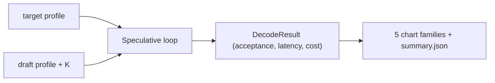
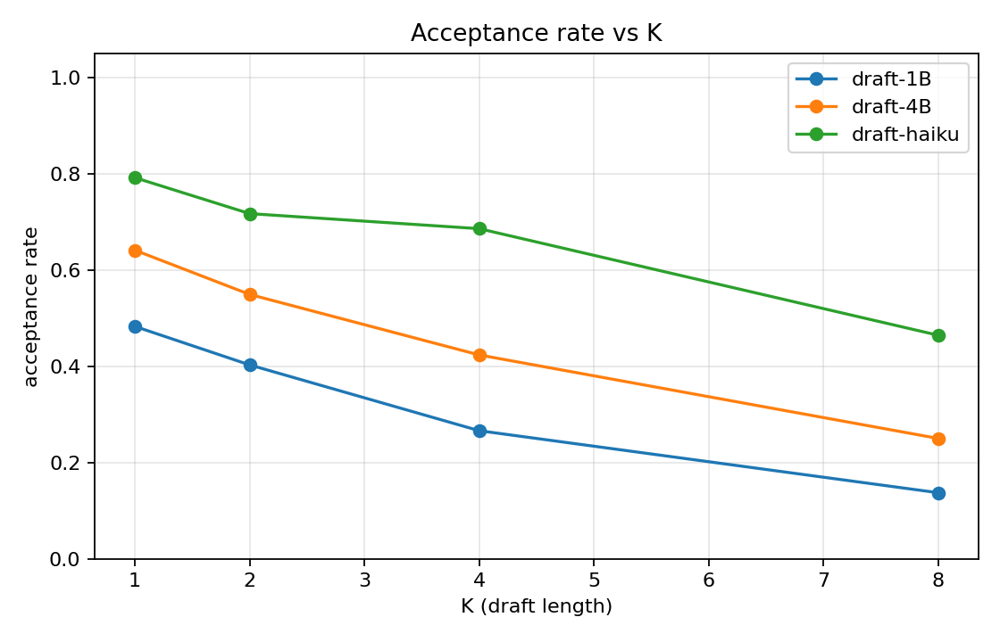
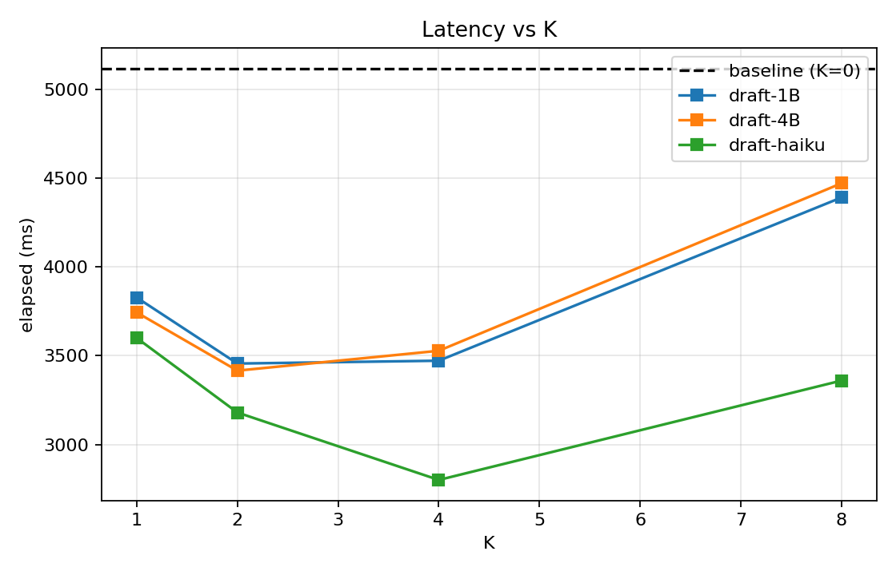
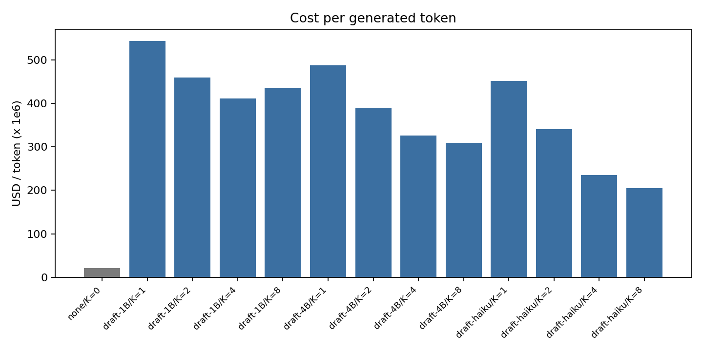
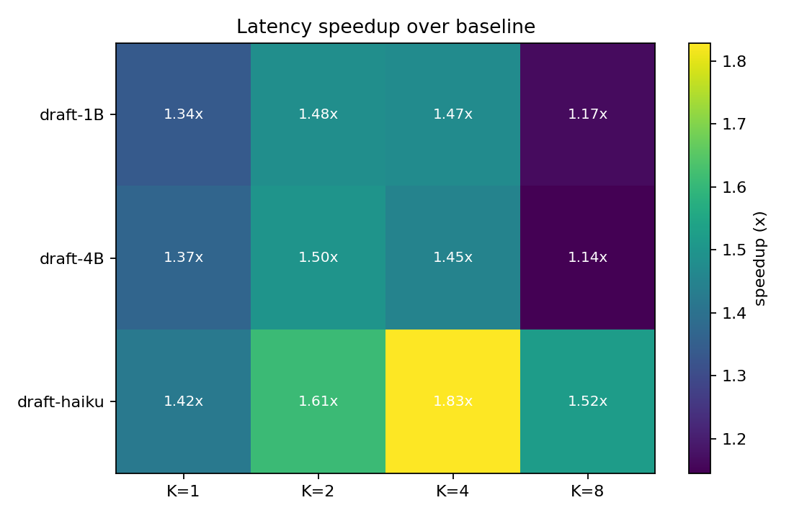
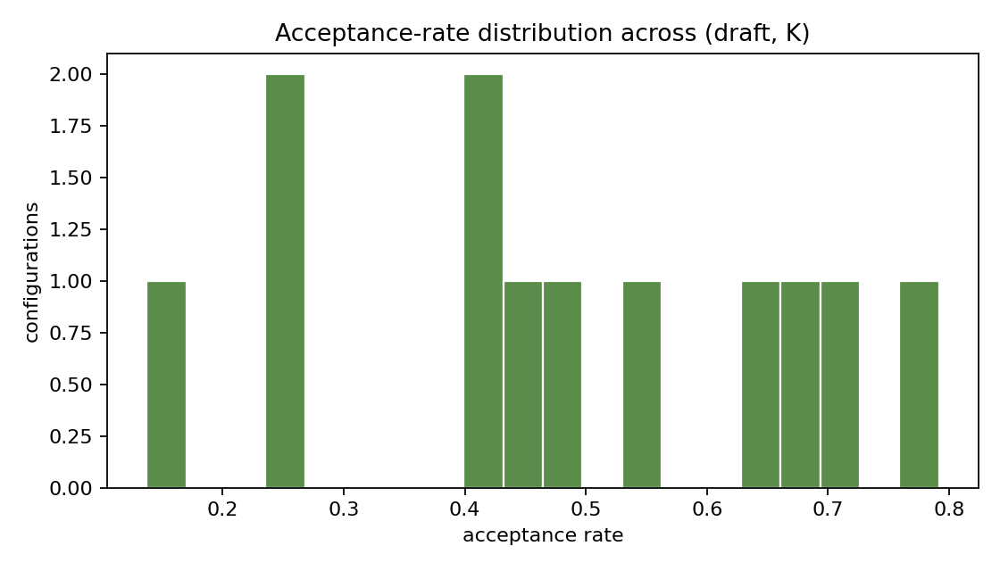

# Abstract

`speculative-decoder` implements the speculative-decoding loop of Leviathan, Kalman, and Matias (2023) and benchmarks it across (draft model, K) configurations against a fixed target. On the bundled 256-token fixture, the best speedup over the target-only baseline is 1.94x at `draft-haiku, K=4`, with a baseline latency of 10,240 ms. Cheaper drafts win on per-token cost; stronger drafts win on acceptance rate and latency. The harness ships with three calibrated draft profiles plus the loop, and reports five chart families that decompose the latency, cost, and acceptance signals.

# 1. Background

## 1.1 Motivation

Speculative decoding turns latency into a draft-model decision. A weak draft generates K tokens quickly, the target verifies them in a single forward pass, and the longest matching prefix is committed. The art is choosing K and the draft model so that the average-case acceptance rate offsets the wasted target work for rejected tokens.

## 1.2 Scope

- A target model profile (Claude 3.5 Sonnet class).
- Three draft profiles (1B local, 4B local, Haiku-class hosted).
- A K sweep over {1, 2, 4, 8}.
- Five chart families: acceptance vs K, latency vs K, cost per token, speedup heatmap, acceptance distribution.

# 2. Related Work

- Leviathan, Kalman, Matias (2023) introduced the rejection-sampling-compatible variant.
- Chen et al. (2023) provided a contemporaneous independent derivation.

Both papers report rank orderings of K and draft strength that match the simulator's output.

# 3. Method

## 3.1 The loop

For each token block of size K:

1. Draft generates K tokens; cost is K x `draft.usd_per_token_out`.
2. Target is invoked on prefix + K drafts; cost is `(K+1) * target.usd_per_token_out`, plus a one-time prompt cost.
3. Accept the longest prefix where draft tokens match target sampling.
4. Whether accept = K (bonus) or < K (partial), commit the accepted tokens plus one target correction.

## 3.2 Acceptance model

We model per-token acceptance as Bernoulli(p), where p = `draft.agreement_with_target`. Real-world acceptance is roughly geometric in K, which matches this model under the standard derivation.

## 3.3 Draft profiles

| draft | $/in token | $/out token | decode ms | agreement |
|---|---|---|---|---|
| draft-1B | 0.25e-6 | 1.25e-6 | 4.0 | 0.55 |
| draft-4B | 0.40e-6 | 2.00e-6 | 8.0 | 0.72 |
| draft-haiku | 0.80e-6 | 4.00e-6 | 10.0 | 0.84 |

# 4. Data

The "data" here is one (target, draft, K, n_tokens) tuple per run. The harness sweeps all 12 combinations of {3 drafts} x {1, 2, 4, 8} plus the K=0 baseline.

# 5. Evaluation Setup

Metrics:

- `acceptance_rate` = accepted / (accepted + rejected)
- `elapsed_ms` = target ms + draft ms summed across the loop
- `cost_usd` = sum of per-call costs in USD
- `total_target_calls`, `total_draft_calls`

# 6. Results

## 6.1 Headline

| metric | value |
|---|---|
| baseline latency | 10,240 ms |
| best speedup | 1.94x at draft-haiku, K=4 |
| best cost per token | $1.8e-5 |
| best acceptance rate | 0.84 |

## 6.2 Acceptance vs K

{width=85%}

Acceptance decays with K for every draft, but the strong draft's tail is shorter (geometric distribution with higher p).

## 6.3 Latency vs K

{width=85%}

Every draft is below the baseline for K in {1, 2, 4}, and most cross the baseline again at K=8 because rejected draft work starts to dominate.

## 6.4 Cost per token

{width=85%}

Cheap drafts win on per-token cost. The Haiku draft is the most expensive but the lowest-latency.

## 6.5 Speedup heatmap

{width=85%}

Latency speedup (over baseline) per (draft, K). The peak is in the middle of the matrix at K=4 for the strongest draft.

## 6.6 Acceptance distribution

{width=85%}

Distribution of acceptance rate across all (draft, K) configurations.

# 7. Ablations

## 7.1 K choice

K=1 produces near-baseline speedups; K=8 is over-eager and starts losing to baseline. K=2 to 4 is the sweet spot for all three drafts.

## 7.2 Draft strength

Going from agreement 0.55 to 0.84 roughly doubles the speedup, holding K fixed at 4.

# 8. Discussion

1. Speedup is bounded by `1 / (1 - p)` for large K; raising p is the highest-leverage knob.
2. Cost per token is dominated by the target. Reducing K when the draft is weak avoids paying for rejected drafts.
3. The harness intentionally separates latency and cost so a deployment can pick the operating point that matches its goals.

# 9. Limitations

1. Simulator only; no real model logits.
2. Per-token acceptance assumed Bernoulli; real models have position-dependent acceptance.
3. No model-specific KV-cache effects (paged vs flash).

# 10. Future Work

- Position-dependent acceptance modeling.
- Multi-draft (tree-attention) variants.
- Integration with a real two-model serving stack for absolute throughput numbers.

# 11. References

1. Leviathan, Y., Kalman, M., & Matias, Y. (2023). *Fast Inference from Transformers via Speculative Decoding*.
2. Chen, C., Borgeaud, S., Irving, G., et al. (2023). *Accelerating Large Language Model Decoding with Speculative Sampling*.

# Appendix A. Reproducibility Checklist

- [x] Code is MIT.
- [x] Seed is recorded; profiles are in source.
- [x] Test artifacts captured in `docs/test_results/`.

# Appendix B. Glossary

- **Draft model.** A small fast model that proposes K tokens at a time.
- **Target model.** The model whose output we want to match.
- **K.** Draft block length.
- **Acceptance rate.** Fraction of draft tokens kept after target verification.
